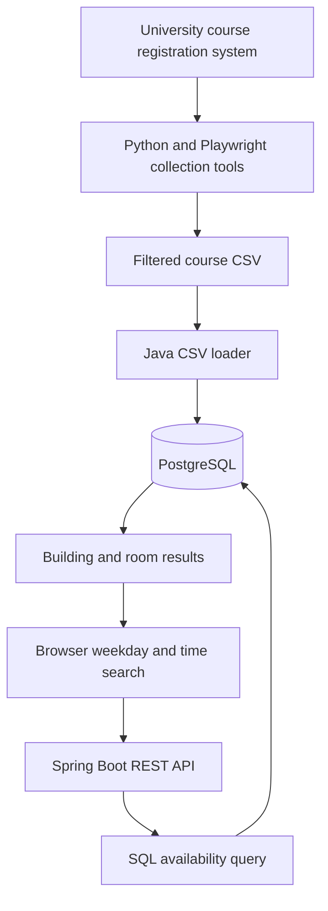

# Campus RoomFinder

Find campus classrooms with no scheduled class at a selected weekday and time.

RoomFinder combines a JavaScript search interface, a Spring Boot REST API, and PostgreSQL to turn university course schedules into searchable room availability. Python and Playwright tools handle course-data collection, while a Java CSV loader converts meeting information into daily schedule records.

The repository includes a **2,231-section course dataset** for exploring the application locally. Results describe availability inferred from class schedules; they do not verify whether a room is physically empty, unlocked, or available for student use.

## Features

- Search by weekday and time through a browser interface.
- Return available building and room pairs through a REST endpoint.
- Exclude rooms with an overlapping scheduled class using a native SQL query.
- Import course meeting data into PostgreSQL with Spring Data JPA.
- Collect term schedules with Playwright, including pagination, retries, duplicate detection, JSON checkpoints, and CSV export.
- Filter online and distance-learning sections from collected data.

## Technology

| Component | Technologies |
| --- | --- |
| Backend | Java 17, Spring Boot, Spring Web MVC |
| Persistence | PostgreSQL, Spring Data JPA, Hibernate |
| Frontend | HTML, CSS, JavaScript, Fetch API |
| Data collection | Python, Playwright, Chromium |
| Build | Maven Wrapper |

## How it works



Data collection and the web application run separately. The backend reads the CSV bundled in its resources directory; it does not run the scraper or fetch live schedules when a user searches.

On startup, the loader reads meeting information from the CSV, extracts building and room names, parses start and end times, and expands weekday strings such as `MW` into separate schedule records. It imports only when the schedule table is empty.

The availability query starts with all distinct rooms in the database, then subtracts rooms occupied by a scheduled class at the requested time:

```sql
SELECT DISTINCT building, room_number
FROM course_schedules
EXCEPT
SELECT building, room_number
FROM course_schedules
WHERE day_of_week = :targetDay
  AND start_time <= :targetTime
  AND end_time > :targetTime;
```

A class blocks a room at its start time, but stops blocking it at its end time. For example, a class scheduled from 10:00 to 11:00 excludes the room at 10:30; at 11:00 it no longer excludes the room unless another class begins then.

## Run locally

### Prerequisites

- JDK 17, matching the Java version configured in `pom.xml`.
- A running PostgreSQL server.
- Git and internet access for the first Maven dependency download.

Python and Playwright are only needed to work on data collection. The web application can use the included CSV independently.

### 1. Clone the repository

```bash
git clone https://github.com/malyarshoaib/RoomFinder.git
cd RoomFinder/room-finder
```

### 2. Create the database

In `psql`, connect as a PostgreSQL administrator and create an application role and database:

```sql
CREATE ROLE roomfinder LOGIN;
\password roomfinder
CREATE DATABASE campus_rooms OWNER roomfinder;
```

The `\password` command prompts for a password. Save it for the application configuration below.

### 3. Configure the database connection

Set these environment variables in your terminal or IDE run configuration:

| Variable | Local example |
| --- | --- |
| `DB_URL` | `jdbc:postgresql://localhost:5432/campus_rooms` |
| `DB_USERNAME` | `roomfinder` |
| `DB_PASSWORD` | The password you assigned to the database role |

For Bash:

```bash
export DB_URL='jdbc:postgresql://localhost:5432/campus_rooms'
export DB_USERNAME='roomfinder'
read -rsp 'Database password: ' DB_PASSWORD
export DB_PASSWORD
```

The `.env.example` file is a reference. Spring Boot does **not** automatically load it or a copied `.env` file in this project.

### 4. Start the application

On Linux or macOS:

```bash
sh mvnw spring-boot:run
```

On Windows, after setting the same environment variables:

```powershell
.\mvnw.cmd spring-boot:run
```

The application uses port `8080` by default. Hibernate is configured to update the database schema, and the loader imports the bundled CSV when the schedule table is empty.

Open [http://localhost:8080](http://localhost:8080), select a weekday and time, and click **Search**.

## API

### `GET /api/rooms/empty`

| Parameter | Format | Example |
| --- | --- | --- |
| `day` | Single weekday character | `M` |
| `time` | ISO local time | `11:00:00` |

Day codes are `M` Monday, `T` Tuesday, `W` Wednesday, `R` Thursday, `F` Friday, `S` Saturday, and `U` Sunday. The browser interface currently offers Monday through Friday.

```bash
curl 'http://localhost:8080/api/rooms/empty?day=M&time=11:00:00'
```

The response is a JSON array of objects containing `building` and `roomNumber`. An illustrative response is:

```json
[
  {
    "building": "Example Building",
    "roomNumber": "101"
  }
]
```

An empty array means no rooms matched the query. Times are interpreted as local schedule times; the API does not accept a date or time zone.

## Data collection

`ScrapeData/scrape_data.py` contains the main term-schedule collection workflow:

1. Open the registration site and establish a Banner search session.
2. Reset the initial search state before requesting term-wide results.
3. Fetch pages of up to 500 sections, retrying failed requests up to three times.
4. Deduplicate records by course reference number and detect repeated pages.
5. Save JSON checkpoints and export all sections to CSV.
6. Filter online and distance-learning sections into a separate CSV.

Its configured output files are `fall_2026_raw.json`, `all_classes.csv`, and `in_person_classes.csv`. `scrape_course_names.py` is a separate utility for collecting course titles from the UNF catalog.

**The main scraper requires setup work before it can run from a fresh clone:**

- `START_URL` contains a placeholder university hostname.
- It imports `sanitize_data` and `scrub_text` from a `sanitize_data.py` module that is not included in the repository.
- The term name and code are configured for Fall 2026, and the session setup uses a fixed initial course-number search.
- Python dependencies are not currently listed in a requirements file.

Once the missing module and site configuration are supplied, install Playwright in a Python virtual environment and install its Chromium browser:

```bash
python -m pip install playwright
python -m playwright install chromium
```

The scripts currently launch a visible browser. After collecting updated data, copy the filtered CSV into `room-finder/src/main/resources/in_person_classes.csv`. Existing database records are not refreshed automatically; replacing the CSV alone does not update a populated schedule table.

## Repository structure

```text
RoomFinder/
├── ScrapeData/
│   ├── scrape_data.py
│   └── scrape_course_names.py
└── room-finder/
    ├── pom.xml
    ├── mvnw
    ├── mvnw.cmd
    ├── .env.example
    └── src/
        ├── main/
        │   ├── java/com/campus/roomfinder/
        │   │   ├── controller/    # REST endpoint and response record
        │   │   ├── entity/        # Course schedule mapping
        │   │   ├── loader/        # CSV import on startup
        │   │   └── repository/    # JPA repository and availability query
        │   └── resources/
        │       ├── application.properties
        │       ├── in_person_classes.csv
        │       └── static/index.html
        └── test/java/com/campus/roomfinder/
            └── RoomFinderApplicationTests.java
```

## Current limitations

- Availability reflects the imported class schedule, not live occupancy, events, reservations, room access rules, or cancellations.
- Only rooms present in the imported schedule data can appear in results.
- Queries use weekday and time without considering calendar dates or semester boundaries.
- The CSV loader handles the first meeting block in a section's meeting string; sections with multiple meeting blocks need fuller parsing. Missing or malformed meeting information also needs stronger handling.
- The frontend calls `http://localhost:8080` directly, so hosting it elsewhere requires changing the API URL.
- Input validation and API error responses are minimal.
- The repository contains a Spring context-load test; dedicated availability-query, API, and CSV-import tests are not yet included.

## Possible next steps

- Complete the scraper setup and document reproducible data refreshes.
- Handle multiple meeting blocks, missing times, and semester date ranges.
- Add automated tests for time boundaries, CSV parsing, and API validation.
- Add building filters and searches for an entire time interval.
- Replace the fixed frontend API URL with a relative or configurable URL.
- Add a repeatable local setup for the application and database.
